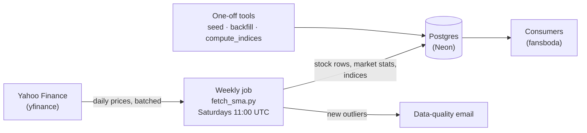

# fansboda-finance

A small weekly data pipeline for US, Swedish, and UK stocks. Every Saturday it downloads daily
prices, computes each stock's 50-day and 200-day simple moving averages and a few measures derived
from them, and builds equal-weighted market and sector indices. Everything is stored in a Postgres
database that consumers (such as the `fansboda` app) read directly — this repository has no user
interface and no API.

This page explains **how every published number is calculated**, then gives a brief overview of
the architecture. It describes calculations, not investment advice.

**Contents**

- [The mathematics](#the-mathematics)
  - [Notation](#notation) · [Weekly snapshot](#weekly-snapshot) ·
    [Simple moving averages](#simple-moving-averages) · [Momentum](#momentum) ·
    [Weekly growth](#weekly-growth) · [Market z-score](#market-z-score) · [Outliers](#outliers)
  - [Equal-weighted indices](#equal-weighted-indices)
  - [When a value is empty](#when-a-value-is-empty) · [Worked examples](#worked-examples)
- [Architecture](#architecture)

---

## The mathematics

### Notation

| Symbol | Meaning |
|---|---|
| $`i`$ | a stock |
| $`d`$ | a trading day; $`d^-`$ is the stock's previous trading day (its previous price bar) |
| $`P_{i,d}`$ | closing price of stock $`i`$ on day $`d`$, adjusted for splits and dividends |
| $`w`$ | a calendar week, Monday to Sunday (stored as `week_start`, the Monday) |
| $`t(w)`$ | the last trading day of week $`w`$ that has a price |
| $`n`$ | a moving-average window, 50 or 200 trading days |
| $`L_d`$ | an index's level on day $`d`$ |

All stored values are rounded to 6 decimals. Formulas are written in standard notation; each one
is followed by a plain-language reading.

### Weekly snapshot

Each stock gets **one row per calendar week**, computed from the stock's daily prices up to the
last trading day of that week, $`t(w)`$ (stored as `trading_date`). If the job runs again later in
the same week and a newer price exists, the newer bar replaces the week's row.

`current_price` is the adjusted close on $`t(w)`$, in the stock's trading currency (`currency`).

### Simple moving averages

```math
\mathrm{SMA}_n(d) = \frac{1}{n}\sum_{k=0}^{n-1} P_{i,\,d-k}
```

The $`n`$-day simple moving average is the plain average of the last $`n`$ daily closes up to and
including day $`d`$ (counting trading days, not calendar days). The pipeline stores
$`\mathrm{SMA}_{50}`$ and $`\mathrm{SMA}_{200}`$ on $`t(w)`$ as `sma_50` and `sma_200`.

A stock needs **at least 200 daily closes**; with fewer it gets no row that week.

### Momentum

```math
m = \frac{\mathrm{SMA}_{50}}{\mathrm{SMA}_{200}}
```

Momentum is the short-term average divided by the long-term average. Above 1 the 50-day average
is above the 200-day average (the stock is in an uptrend by this measure); below 1 it is beneath
it. For example $`m = 1.05`$ means the 50-day average is 5 % above the 200-day average.

### Weekly growth

For $`x`$ = price, SMA-50, or SMA-200:

```math
g_x = \frac{x_{t(w)}}{x_{t(w-1)}} - 1
```

Weekly growth is the relative change since the last trading day of the previous calendar week,
stored as `price_growth`, `sma_50_growth`, and `sma_200_growth` (0.10 = +10 %). Each SMA end uses
only closes up to its own day.

Both ends come from **one** price download. Splits and dividends re-base a stock's whole adjusted
history, so values stored in different weeks can sit on different bases; growth is therefore never
computed by dividing two stored rows. Growth is empty when the download has no bar in the
previous week.

### Market z-score

Stocks are grouped by their exchange market as reported by Yahoo Finance (for example
`us_market`, `se_market`). For each market and week, over the $`N`$ stocks with a momentum value:

```math
\mu = \frac{1}{N}\sum_{j=1}^{N} m_j
\qquad
\sigma = \sqrt{\frac{1}{N}\sum_{j=1}^{N} (m_j - \mu)^2}
\qquad
z_i = \frac{m_i - \mu}{\sigma}
```

$`\mu`$ is the market's average momentum that week and $`\sigma`$ its **population** standard
deviation (divided by $`N`$, not $`N-1`$); both are stored per market and week as `momentum_mean`
and `momentum_std`. The stock's `z_score` says how many standard deviations its momentum lies
above (positive) or below (negative) its market that week.

### Outliers

A stock-week is an **outlier** when any of its three weekly growths is

- above **9.0** (more than ×10, i.e. +900 %; setting `OUTLIER_MAX_GROWTH`), or
- below **−0.999** (a fall of more than 99.9 %; setting `OUTLIER_MIN_GROWTH`).

Such moves are almost always data errors (bad ticks, unadjusted splits). The stock's row is still
stored; newly detected outliers (not already an outlier the week before) are sent to the owner in
one data-quality email. The same two bounds also remove implausible **daily** returns from the
indices (below).

### Equal-weighted indices

#### Index names

Each country has one **market index** of all its stocks and one **sector index** per sector:

| Country | Market index | Label | Currency | Sector index example |
|---|---|---|---|---|
| US | `US-IDX` | NYSE & Nasdaq | USD | `US-IDX-TECHNOLOGY` — "Technology" |
| Sweden | `SWE-IDX` | OMX Stockholm | SEK | `SWE-IDX-INDUSTRIALS` — "Industrials" |
| UK | `UK-IDX` | FTSE London | GBP | `UK-IDX-ENERGY` — "Energy" |

The label is stored in the `sector` column (the market name on market rows, the sector name on
sector rows). Stocks without a sector belong to the market index only.

#### Daily returns and averaging

For each member stock and each of its trading days:

```math
r_{i,d} = \frac{P_{i,d}}{P_{i,d^-}} - 1
```

A member's daily return compares its close with its own previous close. Returns above 9.0 or below
−0.999 (the outlier bounds) are dropped. The index's return for the day is the **equal-weighted**
average over the set $`M_d`$ of members that have a return that day:

```math
\bar r_d = \frac{1}{|M_d|}\sum_{i \in M_d} r_{i,d}
```

Every member counts the same, whatever its price or size.

#### Index level

```math
L_d = L_{d^-}\,(1 + \bar r_d)
```

The level moves each day by the day's average return, compounding. The series is fixed at one
known point:

- **Initialization and new sectors:** $`L = 100`$ on the start date. Levels before the start date
  are found by dividing backward, $`L_{d^-} = L_d / (1 + \bar r_d)`$.
- **Weekly run:** the series continues from the index's latest stored level.

#### Start date

Indices start on **2025-10-03** (setting `INDEX_START_DATE`) when at least **5** members
(`INDEX_MIN_COMPONENTS`) have a close on that day; otherwise on the last trading day of the first
later week that has at least 5. Before the start date, **250** trading days of levels
(`INDEX_HISTORY_TRADING_DAYS`) are reconstructed backward, so the moving averages are full from
the first stored row.

#### Index moving averages and momentum

```math
\mathrm{SMA}_n^{\,\mathrm{idx}}(d) = \frac{1}{n}\sum_{k=0}^{n-1} L_{d-k}
\qquad
m^{\mathrm{idx}} = \frac{\mathrm{SMA}_{50}^{\,\mathrm{idx}}}{\mathrm{SMA}_{200}^{\,\mathrm{idx}}}
```

The same definitions as for stocks, applied to the index's daily levels: the averages of its last
50 and 200 levels (fewer if the series is shorter), and their ratio.

#### Weekly index row

Each index stores one row per week. Its date is the last day of the week in the index's series
(the start date itself in the start week); `current_price` is the level that day, with `sma_50`,
`sma_200`, and `momentum` as above.

#### Members and uptrend

From the stocks' stored rows of the same week, counting only stocks in the index's group with a
positive price, SMA-50, and SMA-200:

```math
\texttt{ticker\_count} = N_w
\qquad
\texttt{pct\_uptrend} = 100 \cdot \frac{\#\{\,i : \mathrm{SMA}_{50,i} > \mathrm{SMA}_{200,i}\,\}}{N_w}
```

`ticker_count` is the number of such stocks, and `pct_uptrend` the percentage of them whose 50-day
average is above their 200-day average.

#### Sector z-score

For one country and week, over the $`S`$ sector indices with a momentum value:

```math
z_s = \frac{m_s - \bar m}{\sigma_S}
\qquad
\bar m = \frac{1}{S}\sum_{k=1}^{S} m_k
\qquad
\sigma_S = \sqrt{\frac{1}{S}\sum_{k=1}^{S} (m_k - \bar m)^2}
```

A sector's z-score compares its momentum with the country's other sectors that week, using the
population standard deviation as for stocks. Market index rows have no z-score.

### When a value is empty

| Value | Empty (NULL) when |
|---|---|
| Stock row | fewer than 200 daily closes — no row is written |
| `momentum` | an SMA is missing or SMA-200 is 0 |
| `price_growth`, `sma_50_growth`, `sma_200_growth` | the download has no bar in the previous calendar week, or the earlier value is 0 |
| Stock `z_score` | momentum is missing, or the market's $`\sigma`$ is 0 (e.g. a market with one stock) |
| Index row | no member has a positive price and both SMAs that week |
| Index `momentum` | index SMA-200 is 0 |
| Index `z_score` | always on market rows; on sector rows with fewer than 2 sectors or $`\sigma_S = 0`$ |

### Worked examples

The examples use small numbers. Where a window is shorter than 50 / 200 it is **for illustration
only**; the app uses 50 and 200.

**1. Moving averages and momentum** (windows 3 and 5). Closes on five days: 10, 11, 12, 13, 14.

```math
\mathrm{SMA}_3 = \frac{12 + 13 + 14}{3} = 13
\qquad
\mathrm{SMA}_5 = \frac{10 + 11 + 12 + 13 + 14}{5} = 12
\qquad
m = \frac{13}{12} = 1.083333
```

**2. Weekly growth.** Last close of the previous week 50, last close of this week 55:

```math
g = \frac{55}{50} - 1 = 0.10 \quad (+10\,\%)
```

**3. Market z-score.** Four stocks in one market have momenta 1.10, 1.00, 0.95, 0.95:

```math
\mu = \frac{1.10 + 1.00 + 0.95 + 0.95}{4} = 1.00
\qquad
\sigma = \sqrt{\frac{0.10^2 + 0^2 + 0.05^2 + 0.05^2}{4}} = \sqrt{0.00375} = 0.061237
```

```math
z_{1.10} = \frac{1.10 - 1.00}{0.061237} \approx 1.633
```

The first stock's momentum is about 1.6 standard deviations above its market.

**4. Index level from 100.** Three members A, B, C; the index starts at 100 on day 0.

| Day | A | B | C | Returns used | Average $`\bar r_d`$ | Level $`L_d`$ |
|---|---|---|---|---|---|---|
| 0 (start) | | | | | | 100 |
| 1 | +2 % | −1 % | +5 % | A, B, C | +2 % | 100 × 1.02 = 102 |
| 2 | +1 % | +3 % | +1500 % | A, B (C's +1500 % > ×10 is dropped) | +2 % | 102 × 1.02 = 104.04 |
| 3 | −2 % | 0 % | −1 % | A, B, C | −1 % | 104.04 × 0.99 = 102.9996 |

Without the outlier rule, day 2's average would be (1 + 3 + 1500) / 3 ≈ +501 % and the index would
jump about sixfold on a single bad price.

---

## Architecture



- **Data source.** Daily prices and company details from Yahoo Finance through the `yfinance`
  library, downloaded in batches with pauses and retries to respect rate limits.
- **Schedule.** One run per week, Saturdays 11:00 UTC, on a small cloud VM (cron). There is no
  intraday or real-time data.
- **Weekly run (`fetch_sma.py`).** Loads the watchlist from the database, skips stocks already
  up to date for the week, downloads about 400 days of prices for the rest, computes the stock
  measures, stores them, recomputes the market statistics and z-scores, extends the indices from
  the same download, deletes old rows, and emails newly found outliers.
- **Storage.** One set of three tables per country — tickers (watchlist and company details),
  weekly stock metrics, and weekly market statistics — for the US, Sweden, and the UK, plus one
  shared `indices` table. Schema changes are versioned SQL files.
- **One-off tools.** `seed_tickers.py` fills the watchlist; `backfill_sma.py` and
  `backfill_market.py` build history for a new country set; `compute_indices.py` initializes the
  indices from their start date. They are run by hand, never on a schedule.
- **Retention.** Rows older than 365 days are deleted on each run.
- **Notifications.** The outlier email is the only message the system sends.
- **Delivery.** Tests run on every push; a commit on `main` that passes them is deployed to the VM
  automatically, with keyless authentication and no credentials in the repository.
- **Cost.** Designed to run at about $0 per month on free tiers.
